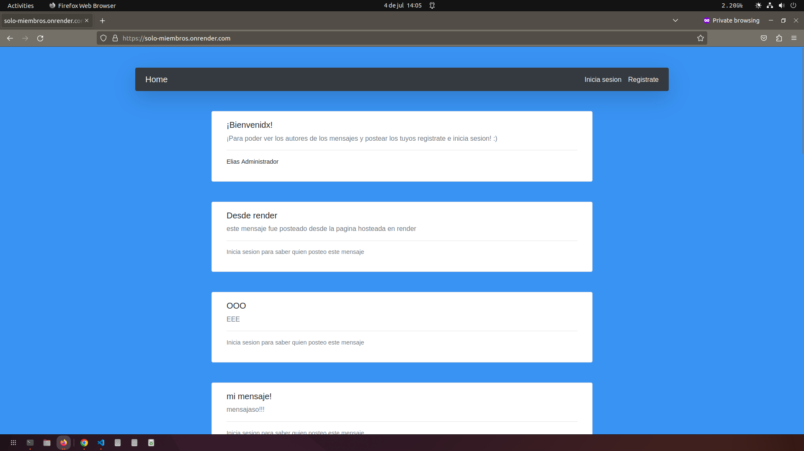
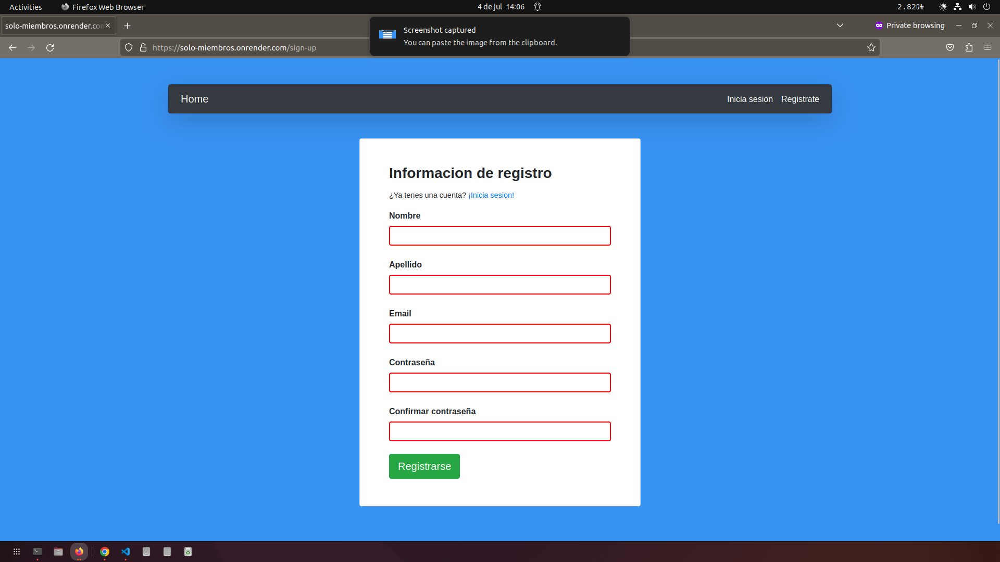

<a name="readme-top"></a>

<!-- PROJECT LOGO -->
<br />
<div align="center">

  <h2 align="center">Solo Miembros</h2>

  <p align="center"><a href="https://solo-miembros.onrender.com/">Link para vistiar la aplicación</a> 👈</p>
</div>

<!-- TABLE OF CONTENTS -->
<details>
  <summary>Tabla de contenidos</summary>
  <ol>
    <li>
      <a href="#sobre-este-proyecto">Sobre este proyecto</a>
      <ul>
        <li><a href="#construido-con">Construido con</a></li>
      </ul>
    </li>
    <li>
      <a href="#como-levantar-la-app">Como levantar la App</a>
      <ul>
        <li><a href="#prerequisitos">Prerequisitos</a></li>
        <li><a href="#instalación">Instalación</a></li>
      </ul>
    </li>
    <li><a href="#qué-aprendí">Qué aprendí</a></li>
    <li><a href="#ejemplos">Ejemplos</a></li>
  </ol>
</details>

## Sobre este proyecto
En esta app los usuarios registrados podrán iniciar sesión y escribir mensajes anónimos para que los demas usuarios vean. Sólo las personas registradas podran ver los autores de los mensajes, las personas que no tengan una cuenta podran ver los mensajes pero podrán saber quien los hizo ni cuando.

<p align="right">(<a href="#readme-top">Volver al inicio</a>)</p>

### Construido con
* NodeJs con express para el backend
* EJS para el Front-End
* Passport.js con la estrategia passport-local para el manejo de sesiones
* bcrypt para el hasheo de las contraseñas
* mongoDB para base de datos
* moongose para interactuar con la base de datos

<p align="right">(<a href="#readme-top">Volver al inicio</a>)</p>

## Como levantar la App

### Prerequisitos
Para correr la aplicación localmente vas a tener que tener tu propia base de datos en mongoDB. Una vez creada la base de datos vamos a introducir la info sensible como variables de entorno:
* Crear un archivo ".env" en la raíz del proyecto y en este escribir
  ```sh
  DB_USER=TuUsuario
  DB_PASS=TuContraseña

  ```
  
### Instalación
* Instalar las dependencias:
  ```sh
  npm install
  ```
* Una vez instaladas las dependencias podremos correr la aplicación con el siguiente comando:
  ```sh
  npm run devstart
  ```
  
<p align="right">(<a href="#readme-top">Volver al inicio</a>)</p>

## Qué aprendí
Con este pequeño proyecto pude aprender a autenticar usuarios en node utilizando passport. Utilizé la estrategia passport-local para que un usuario pueda logearse de forma segura. También aprendí a deployear una app a render.

  <p align="right">(<a href="#readme-top">Volver al inicio</a>)</p>

## Ejemplos
Algunas capturas de ejemplo para ver cómo es la App
* Home page sin logearse
  <div align="center">
    
  </div>
* Registro de usuario nuevo
  <div align="center">
    
  </div>


  <p align="right">(<a href="#readme-top">Volver al inicio</a>)</p>
